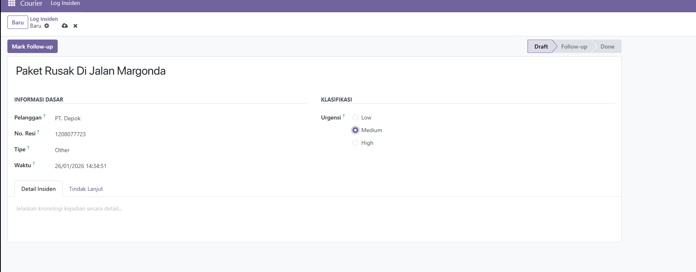
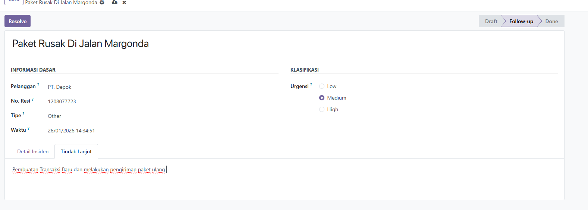
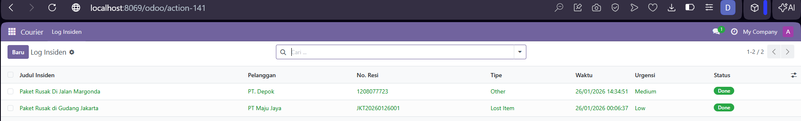

# Courier Core - Incident Log System

## Deskripsi

Modul Odoo 18 untuk sistem pencatatan dan pengelolaan insiden operasional BeraniExpress. Sistem ini membantu tim operasional mencatat dan menindaklanjuti berbagai kendala seperti keterlambatan pengiriman, barang hilang, atau masalah kesehatan kurir.

## Struktur Modul

```
courier_core/
├── __init__.py
├── __manifest__.py
├── models/
├── views/
├── security/
└── README.md
```

## Instalasi

### Prasyarat

- Odoo 18.0 terinstal
- Python 3.10+
- PostgreSQL

## Teknologi

- **Platform**: Odoo 18.0
- **Bahasa**: Python 3.10+
- **Framework**: Odoo ORM
- **Database**: PostgreSQL

## Manual Testing

Berikut adalah langkah-langkah untuk menguji fungsi sistem incident log:

### 1. Create Incident and Mark Follow-up (Membuat Insiden Baru)

1. Buka menu **Courier Core** > **Incidents**
2. Klik tombol **Create** atau **New**
3. Isi form incident dengan informasi berikut:
   - **Title**: Judul insiden (contoh: "Paket Terlambat - Area Jakarta Selatan")
   - **Description**: Deskripsi detail insiden
   - **Incident Type**: Pilih tipe insiden (Delivery Delay, Lost Package, Courier Health Issue, dll)
   - **Severity**: Pilih tingkat keparahan (Low, Medium, High, Critical)
   - **Courier**: Pilih kurir terkait (jika ada)
4. Klik **Save**
5. Status incident akan otomatis menjadi **Draft**



### 2. Resolve Incident (Menyelesaikan Insiden)

1. Buka incident yang sudah dibuat
2. Klik tombol **Resolve**
3. Status akan berubah menjadi **Done**
4. Incident sekarang ditandai sebagai perlu tindak lanjut dari tim terkait



### 3. Table View Done (Menyelesaikan Insiden)

1. Buka incident yang berstatus **Done**
2. Incident sekarang ditandai sebagai sudah diselesaikan



### Catatan Testing

- Pastikan user memiliki hak akses yang sesuai untuk melakukan operasi Create, Mark Follow-up, dan Resolve
- Setiap perubahan status akan tercatat dalam sistem untuk keperluan audit
- Incident yang sudah di-resolve masih dapat dilihat untuk referensi historis

## Lisensi

LGPL-3

## Author

Deandro Najwan Ahmad Syahbanna

## Referensi

- [Odoo 18 Documentation](https://www.odoo.com/documentation/18.0/)
- [Odoo ORM API](https://www.odoo.com/documentation/18.0/developer/reference/backend/orm.html)
- [Odoo Views](https://www.odoo.com/documentation/18.0/developer/reference/backend/views.html)
